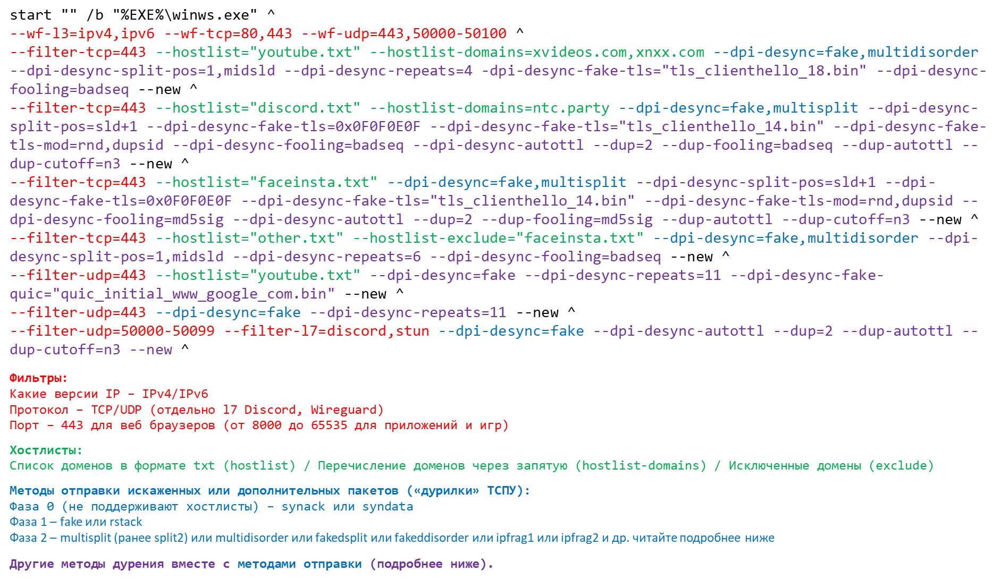
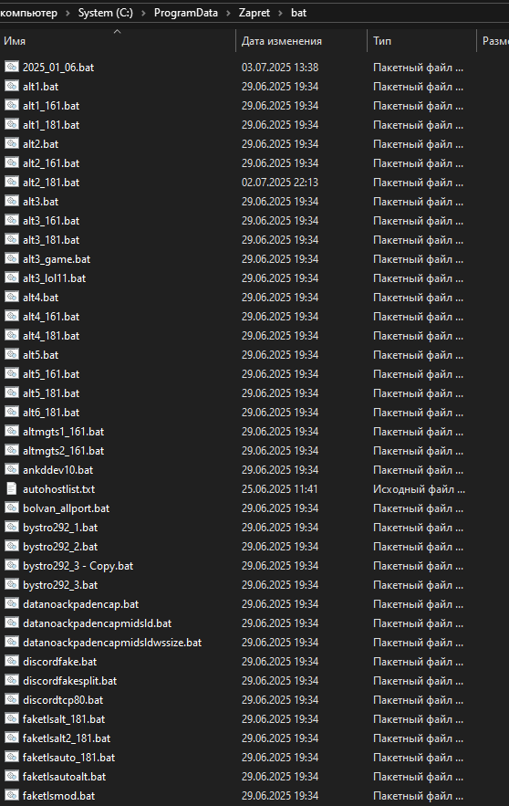
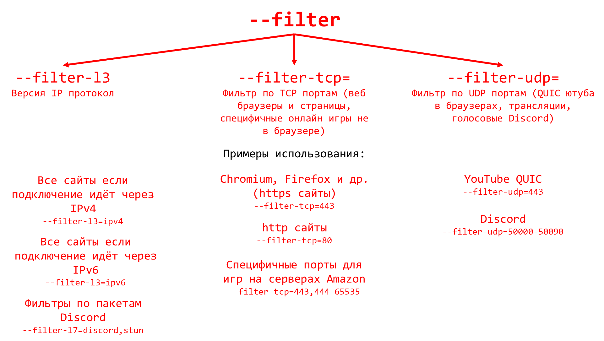
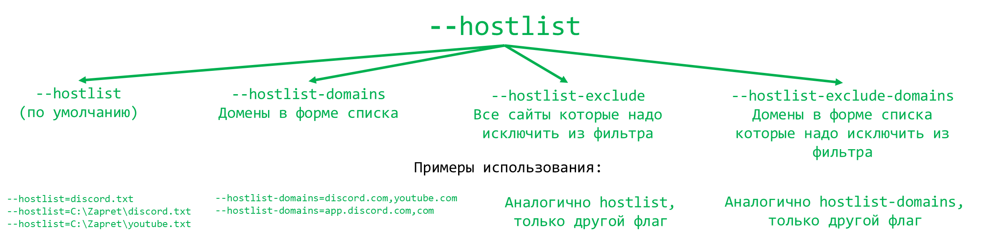
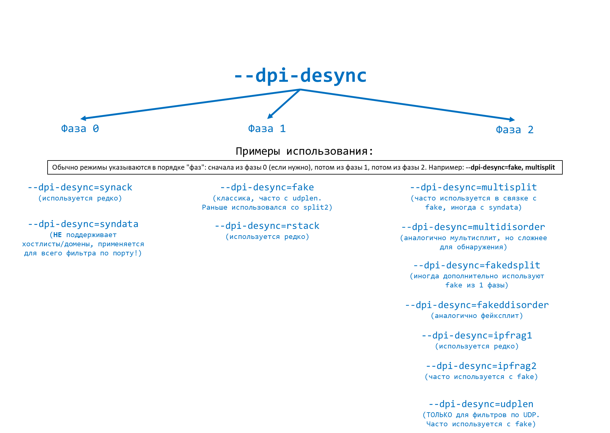

### [Коротко и для совсем чайников](whatfuckthis.md)
## Основная идея: Обмануть "Интернет-Цензора"
Ваш интернет-провайдер установил специальную систему (в мире такие системы называется `DPI`, в России это называется `ТСПУ`), которая следит за всем вашим интернет-трафиком. Если этой системе что-то не нравится (например, Вы пытаетесь зайти на заблокированный сайт), она может заблокировать доступ и разорвать соединение.

Программа типа Zapret (в данном случае nfqws), пытается "обмануть" эту систему-цензора. Она берет ваш запрос к сайту и немного его изменяет - так, чтобы сайт Вас понял, а вот "цензор" запутался и пропустил ваш запрос до адресата.

Она "ловит" ваши пакеты данных перед тем, как они уйдут в интернет, колдует над ними и отправляет дальше. Чтобы она их ловила, нужны специальные правила в системе (это iptables или nftables – своего рода "регулировщики трафика" в Linux).

## Полный пример стратегии/конфигурации
Zapret программа консольная, поэтому запускают её на самом деле флаги, которые рассказывают программе как следует работать. 

Пример ниже для Windows (используются командные файлы `bat`):
```bash
start "" /b "%EXE%\winws.exe" ^
--wf-l3=ipv4,ipv6 --wf-tcp=80,443 --wf-udp=443,50000-50100 ^
--filter-tcp=443 --hostlist="youtube.txt" --hostlist-domains=xvideos.com,xnxx.com --dpi-desync=fake,multidisorder --dpi-desync-split-pos=1,midsld --dpi-desync-repeats=4 -dpi-desync-fake-tls="tls_clienthello_18.bin" --dpi-desync-fooling=badseq --new ^
--filter-tcp=443 --hostlist="discord.txt" --hostlist-domains=ntc.party --dpi-desync=fake,multisplit --dpi-desync-split-pos=sld+1 --dpi-desync-fake-tls=0x0F0F0E0F --dpi-desync-fake-tls="tls_clienthello_14.bin" --dpi-desync-fake-tls-mod=rnd,dupsid --dpi-desync-fooling=badseq --dpi-desync-autottl --dup=2 --dup-fooling=badseq --dup-autottl --dup-cutoff=n3 --new ^
--filter-tcp=443 --hostlist="faceinsta.txt" --dpi-desync=fake,multisplit --dpi-desync-split-pos=sld+1 --dpi-desync-fake-tls=0x0F0F0E0F --dpi-desync-fake-tls="tls_clienthello_14.bin" --dpi-desync-fake-tls-mod=rnd,dupsid --dpi-desync-fooling=md5sig --dpi-desync-autottl --dup=2 --dup-fooling=md5sig --dup-autottl --dup-cutoff=n3 --new ^
--filter-tcp=443 --hostlist="other.txt" --hostlist-exclude="faceinsta.txt" --dpi-desync=fake,multidisorder --dpi-desync-split-pos=1,midsld --dpi-desync-repeats=6 --dpi-desync-fooling=badseq --new ^
--filter-udp=443 --hostlist="youtube.txt" --dpi-desync=fake --dpi-desync-repeats=11 --dpi-desync-fake-quic="quic_initial_www_google_com.bin" --new ^
--filter-udp=443 --dpi-desync=fake --dpi-desync-repeats=11 --new ^
--filter-udp=50000-50099 --filter-l7=stun,discord --dpi-desync=fake --dpi-desync-autottl --dup=2 --dup-autottl --dup-cutoff=n3 --new ^
```

Разберём в цветах:


Чтобы перейти к этим батникам нажмите на кнопку:


После чего зайдите в папку `bat`:



## Как собрать свою стратегию?
Надо всего лишь комбинировать эти флаги чтобы добиться максимальной работоспособности для всех сайтов и сервисов. Подробнее о них ниже.

## --filter


Давайте подробно разберем группу параметров `--filter-...`. Эти параметры используются внутри "профилей" (которые создаются с помощью `--new`) в `nfqws` для того, чтобы точно указать, к какому именно интернет-трафику должен применяться данный конкретный профиль с его набором "трюков".

**Основная идея: "Этот набор трюков – только для такого-то трафика"**

Когда `nfqws` получает пакет данных, она должна решить, какой из ваших настроенных профилей (если их несколько) использовать для этого пакета. Фильтры помогают ей принять это решение. Если пакет соответствует *всем* фильтрам, указанным в профиле, то этот профиль активируется для данного пакета.

**Основные типы фильтров:**

1.  **`--filter-l3=ipv4|ipv6` (Фильтр по версии IP-протокола):**
    *   **Что делает:** Указывает, что профиль должен применяться только к трафику IPv4 или только к трафику IPv6.
    *   **Пример:**
        *   `--filter-l3=ipv4`: Профиль будет работать только для пакетов IPv4.
        *   `--filter-l3=ipv6`: Профиль будет работать только для пакетов IPv6.
    *   **Когда использовать:** Если у вас разные стратегии обхода DPI для IPv4 и IPv6 (например, IPv6 может быть менее подвержен фильтрации, или для него есть специфичные трюки типа `hopbyhop`).

2.  **`--filter-tcp=[~]port1[-port2]|*` (Фильтр по TCP-портам):**
    *   **Что делает:** Указывает, что профиль должен применяться только к TCP-трафику, идущему на определенные порты назначения (или с определенных портов источника, в зависимости от того, как вы настроили `iptables`/`nftables` для перенаправления трафика в `nfqws`).
    *   **Синтаксис:**
        *   `*`: Любой TCP-порт.
        *   `port1`: Только один конкретный порт (например, `80` для HTTP, `443` для HTTPS).
        *   `port1-port2`: Диапазон портов (например, `1000-2000`).
        *   `~` (тильда в начале): Инверсия. Означает "любой порт, КРОМЕ указанных". Например, `~80` – любой TCP-порт, кроме 80-го.
        *   Список через запятую: Можно указать несколько портов или диапазонов, например, `80,443,8080-8090`.
    *   **Пример:**
        *   `--filter-tcp=443`: Профиль только для HTTPS-трафика.
        *   `--filter-tcp=~22`: Профиль для всего TCP-трафика, кроме SSH (порт 22).
    *   **Важно:** Если вы устанавливаете фильтр по TCP-портам (`--filter-tcp`) и *не* устанавливаете фильтр по UDP-портам (`--filter-udp`) в этом же профиле, то UDP-трафик для этого профиля будет автоматически запрещен (не будет ему соответствовать).

3.  **`--filter-udp=[~]port1[-port2]|*` (Фильтр по UDP-портам):**
    *   **Что делает:** Аналогично `--filter-tcp`, но для UDP-трафика.
    *   **Пример:**
        *   `--filter-udp=53`: Профиль только для DNS-трафика (если вы перехватываете UDP DNS).
        *   `--filter-udp=443`: Профиль для QUIC-трафика (часто использует UDP порт 443).
    *   **Важно:** Если вы устанавливаете фильтр по UDP-портам и *не* устанавливаете фильтр по TCP-портам, то TCP-трафик для этого профиля будет запрещен.

4.  **`--filter-l7=<proto>` (Фильтр по протоколу прикладного уровня L7):**
    *   **Что делает:** Указывает, что профиль должен применяться только к трафику, который `nfqws` распознала как определенный протокол прикладного уровня.
    *   **Поддерживаемые значения для `<proto>` (могут меняться/дополняться):**
        *   `http`: Обычный HTTP-трафик.
        *   `tls`: TLS-трафик (HTTPS).
        *   `quic`: QUIC-трафик.
        *   `wireguard`: WireGuard VPN-трафик (начальные пакеты).
        *   `dht`: DHT-трафик (используется в торрентах).
        *   `discord`: Голосовой трафик Discord (определение IP).
        *   `stun`: STUN-трафик (для определения внешнего IP).
        *   `unknown`: Трафик, протокол которого `nfqws` не смогла определить.
    *   **Список через запятую:** Можно указать несколько протоколов, например, `--filter-l7=http,tls`.
    *   **Когда использовать:** Если у вас разные трюки для разных протоколов. Например, для HTTP можно использовать `--hostcase`, а для TLS – сложные `dpi-desync` с фейками.
    *   **Зависимость:** Распознавание L7-протокола происходит обычно после получения первого пакета с данными. Поэтому этот фильтр может не сработать для трюков "нулевой фазы" (которые применяются к самым первым SYN/SYN-ACK пакетам), если только протокол не был определен по другим признакам (например, по стандартному порту в сочетании с другими фильтрами).

**Как фильтры работают вместе внутри одного профиля:**

Если в одном профиле указано несколько фильтров (например, `--filter-l3=ipv4 --filter-tcp=443 --filter-l7=tls`), то пакет должен соответствовать **ВСЕМ** этим условиям, чтобы профиль был активирован. Это логическое "И".

**Связь с другими фильтрами (`--hostlist`, `--ipset`):**

Фильтры `--filter-...` обычно проверяются *до* фильтров по спискам хостов (`--hostlist`) или IP-адресов (`--ipset`).
Порядок проверки примерно такой:
1.  Версия IP (`--filter-l3`).
2.  IP-адрес (из `--ipset`, если есть).
3.  Порты TCP/UDP (`--filter-tcp`, `--filter-udp`).
4.  Протокол L7 (`--filter-l7`).
5.  Имя хоста (из `--hostlist`, если есть и если имя хоста уже известно).

Если пакет не проходит хотя бы один из этих фильтров на любом этапе, программа переходит к проверке следующего профиля.

**Примеры использования профилей с фильтрами:**

```batch
# Профиль 1: Для заблокированных HTTPS сайтов
nfqws.exe ^
    --filter-tcp=443 ^
    --filter-l7=tls ^
    --hostlist=global_blocked_https.txt ^
    --dpi-desync=fake,multisplit ^
    ... (другие опции для этого профиля) ... ^
    --new ^
# Профиль 2: Для заблокированных HTTP сайтов
    --filter-tcp=80 ^
    --filter-l7=http ^
    --hostlist=global_blocked_http.txt ^
    --hostcase ^
    --methodeol ^
    ... (другие опции для этого профиля) ... ^
    --new ^
# Профиль 3: Для QUIC трафика к определенным хостам
    --filter-udp=443 ^
    --filter-l7=quic ^
    --hostlist=quic_problem_hosts.txt ^
    --dpi-desync=udplen --dpi-desync-udplen-increment=20 ^
    ... ^
    --new ^
# Профиль 4: Общий "безопасный" профиль для всего остального HTTPS, если нужно что-то простое
    --filter-tcp=443 ^
    --filter-l7=tls ^
    --hostspell=HoSt ^
    --domcase
```

В этом примере:
*   Если приходит пакет на TCP порт 443, распознанный как TLS, и хост есть в `global_blocked_https.txt`, сработает Профиль 1.
*   Если это HTTP на порт 80, и хост в `global_blocked_http.txt`, сработает Профиль 2.
*   И так далее.

Первый фильтр имеет более высокий приоритет, по сравнению с фильтрами написанными ниже.

## --hostlist


Представьте, что у вас есть набор "магических трюков" (`nfqws` с ее настройками), чтобы обманывать "Интернет-Цензора" (DPI). Но эти трюки могут быть не нужны для всех сайтов. Некоторые сайты и так работают нормально, а применение к ним лишних трюков может их замедлить или даже сломать.

Параметры `hostlist` позволяют вам сказать программе: "**Используй эти магические трюки только для сайтов из этого списка, а остальные не трогай**" (или наоборот, "**Не используй трюки для сайтов из этого списка исключений**").

**Как это работает:**

1.  **`--hostlist=<имя_файла>` (Список включения):**
    *   **Что это:** Вы создаете текстовый файл. В каждой строке этого файла вы пишете имя сайта (домен первого уровня, без `https:\\`, `www`), к которому нужно применять трюки `nfqws`.
        ```
        blocked-site.com
        another-blocked-site.org
        example.net
        ru
        blockedsite.com
        ^onlyThisSite.com
        ```
    *   **Как работает программа:** Когда вы пытаетесь зайти на какой-то сайт, `nfqws` "смотрит" на имя этого сайта (из HTTP-заголовка `Host:` или из TLS SNI для HTTPS). Если это имя есть в вашем файле `--hostlist` (или является поддоменом сайта из списка, например, `sub.blocked-site.com` тоже попадет под правило для `blocked-site.com`. Если нужно вписать всю доменную зону `*.ru` то пишите в новой строчке просто `ru`), то `nfqws` применит к этому соединению все настроенные трюки (из `--dpi-desync`, `--hostcase` и т.д. в текущем профиле). Если сайта в списке нет, `nfqws` пропустит трафик к нему без изменений (в рамках этого профиля).
    *   **Поддомены:** По умолчанию, если в списке есть `example.com`, то и `mail.example.com`, и `www.example.com` тоже будут обрабатываться. Если вы хотите обрабатывать *только* `example.com` и не трогать его поддомены, напишите в файле `^example.com` (с символом `^` в начале).
    *   **Перезагрузка списка:** Если вы измените этот файл, пока `nfqws` работает, программа автоматически его перечитает, когда ей это понадобится.
    *   **Gzip:** Файл списка может быть сжат с помощью `gzip` (например, `blocked-sites.txt.gz`), программа сама его распакует.
    *   **Множество списков:** Можно указать несколько параметров `--hostlist` с разными файлами. Они все будут объединены.

2.  **`--hostlist-domains=<список_доменов_через_запятую>` (Список включения, прямо в команде):**
    *   **Что это:** Вместо файла, вы можете перечислить домены прямо в командной строке.
        `--hostlist-domains=blocked.com,another.org,#commented.net`
        (Символ `#` в начале домена означает, что это комментарий, и этот домен обрабатываться не будет).
    *   **Удобство:** Для коротких списков.

3.  **`--hostlist-exclude=<имя_файла>` (Список исключения):**
    *   **Что это:** Аналогично `--hostlist`, но наоборот. Сайты из этого списка **НЕ будут** обрабатываться `nfqws` (даже если они попали в какой-то общий список включения или если нет списков включения и по умолчанию обрабатываются все).
    *   **Пример:** У вас есть широкий `--hostlist` с общими правилами, но вы знаете, что сайт `very-sensitive-site.com` ломается от ваших трюков. Вы добавляете `very-sensitive-site.com` в файл для `--hostlist-exclude`.

4.  **`--hostlist-exclude-domains=<список_доменов_через_запятую>` (Список исключения, прямо в команде):**
    *   Аналогично `--hostlist-domains`, но для исключений.

5.  **`--hostlist-auto=<имя_файла>` (Автоматическое создание списка):**
    *   **Что это:** Это очень интересный режим! `nfqws` пытается сама определить, какие сайты у вас блокируются, и автоматически добавляет их имена в указанный файл.
    *   **Как работает (упрощенно):**
        *   Ей нужно "видеть" не только исходящий, но и *входящий* трафик (ответы от серверов или от DPI). Это настраивается через `iptables`/`nftables`.
        *   Если `nfqws` замечает, что вы отправили запрос на сайт, а в ответ быстро пришел пакет сброса (RST) или страница-заглушка от DPI, она "подозревает", что сайт заблокирован.
        *   Если таких "подозрений" для одного и того же сайта наберется несколько за короткое время (настраивается через `--hostlist-auto-fail-threshold` и `--hostlist-auto-fail-time`), `nfqws` добавляет этот сайт в файл, указанный в `--hostlist-auto`.
        *   После этого к сайтам из этого авто-списка будут применяться трюки `nfqws`.
    *   **Плюсы:** Не нужно вручную составлять списки заблокированных сайтов.
    *   **Минусы:** Может ошибаться (ложные срабатывания). Требует более сложной настройки правил `iptables`/`nftables` для анализа входящего трафика.
    *   `--hostlist-auto-retrans-threshold=<int>`: Сколько повторных передач (ре-трансмиссий) запроса без ответа считать признаком блокировки.
    *   `--hostlist-auto-debug=<logfile>`: Записывать в лог, почему программа решила добавить тот или иной хост в авто-список. Полезно для отладки.

**Как это сочетается с профилями (`--new`):**

Каждый профиль (стратегия), который вы создаете с помощью `--new`, может иметь свои собственные `hostlist`-ы. Это позволяет очень гибко настраивать поведение:

*   Профиль 1: Для сайтов из `super-blocked-list.txt` использовать агрессивные трюки.
*   Профиль 2: Для сайтов из `lightly-blocked-list.txt` использовать более мягкие трюки.
*   Профиль 3 (без hostlist): Для всего остального трафика (если предыдущие профили не подошли) – не делать ничего или применить какие-то очень общие безопасные трюки.

**Важный момент:**

Определение имени хоста происходит обычно на основе первого пакета с данными (HTTP-запрос или TLS ClientHello). Это означает, что трюки, которые должны сработать *до* отправки этих данных (например, некоторые из "Фазы 0" десинхронизации, как `syndata`), не смогут использовать `hostlist` для принятия решения, так как имя хоста еще неизвестно. Однако, если включено кэширование IP-адресов и имен хостов (`--ipcache-hostname`), то для уже известных IP программа может "вспомнить" имя хоста и применить `hostlist` даже для Фазы 0.

## --dpi-desync


Главный инструмент для активного "обмана" DPI путем отправки искаженных или дополнительных пакетов, которые сбивают DPI с толку, но позволяют реальному серверу правильно обработать ваш запрос.

Обычно режимы указываются в порядке "фаз": сначала из фазы 0 (если нужно), потом из фазы 1, потом из фазы 2. Например: `--dpi-desync=fake, multisplit`

Разные "Интернет-Цензоры" (DPI) работают по-разному и имеют разные слабости. Какой-то DPI можно обмануть простым fake. Для другого понадобится комбинация из fake + badsum + multidisorder с определенными позициями нарезки. Часто приходится экспериментировать, чтобы найти рабочий вариант для Вашего провайдера.

Это означает: сначала послать поддельный запрос (fake), а потом настоящий запрос разрезать на кусочки (multisplit) и отправить.

### Фаза 0
Фаза когда Вы только-только начинаете разговор с сайтом.
- `synack`: Вы отправляете первый пакет "Привет, хочу подключиться!" (SYN). В ответ программа может послать пакет, который выглядит так, будто сервер Вам ответил согласием (SYN-ACK), хотя на самом деле это еще не так. ТСПУ может подумать, что уже все нормально, и ослабить бдительность.
- `syndata`: В самый первый пакет "Привет!" (SYN) добавляется немного "мусорных" данных. Обычные серверы этот мусор проигнорируют, а ТСПУ может попытаться его проанализировать и запутаться.

### Фаза 1
Отправка чего-то перед вашим настоящим запросом
- `fake`: Самый популярный трюк. Перед тем, как отправить Ваш настоящий запрос (например, "дай мне сайт Х"), программа отправляет совершенно другой, "безобидный" запрос (например, "дай мне сайт Google"). ТСПУ видит этот безобидный запрос, решает, что все в порядке, и может не так внимательно смотреть на ваш следующий, уже настоящий, запрос к сайту Х.
- - Чтобы этот поддельный запрос не дошел до настоящего сайта Google и не вызвал ошибок, используются дополнительные "обманки" из параметра `--dpi-desync-fooling` (например, испортить контрольную сумму пакета, чтобы Google его отбросил, или установить очень маленькое "время жизни" пакета, чтобы он "умер" по пути).
  - Можно указать, какой именно поддельный запрос слать:
  - - `--dpi-desync-fake-http=<файл>`: Использовать содержимое файла как поддельный HTTP-запрос.
    - `--dpi-desync-fake-tls=<файл>`: Для HTTPS. Можно даже взять настоящий запрос к разрешенному сайту и использовать его как "прикрытие".
- `rst` или `rstack`: Послать пакет "сброса соединения" (RST). ТСПУ может подумать, что вы сами разорвали соединение и перестанет следить. А ваш компьютер и сервер на самом деле продолжат общение, зная, что RST был ложным.

### Фаза 2
Изменение самого вашего запроса или его частей
- `multisplit`: Ваш запрос (например, `GET /kartinka.jpg HTTP/1.1`) "нарезается" на очень много мелких кусочков (`GE`, `T `, `/k`, `ar`, `ti`, `nk`, `a.j` и т.д.) и отправляется так. Некоторые ТСПУ не умеют правильно собирать такие пазлы.
  - `--dpi-desync-split-pos=N` (или marker+N): Указывает, где именно резать. Например, "резать после 2-го символа" или "резать посередине названия сайта".
- `multidisorder`: То же самое, что `multisplit`, бывший `disorder2`, но кусочки отправляются вперемешку, не по порядку. Это еще больше путает ТСПУ.
- `fakedsplit` / `fakeddisorder`: Более сложная "нарезка". Ваш запрос делится (например, на 2 части). Каждая часть "оборачивается" с двух сторон фальшивыми данными. То есть отправляется что-то вроде: `фальшивка` + `1-я часть запроса` + `фальшивка` ... и так же со второй частью. ТСПУ видит много мусора и может не найти настоящий запрос.
  - `--dpi-desync-fakedsplit-pattern=<файл_или_HEX>`: Чем заполнять эти фальшивые "обертки".
- `ipfrag1` / `ipfrag2`: Это тоже "нарезка", но на более низком уровне сети (на уровне IP-пакетов, а не TCP-сегментов). Иногда работает, если обычная "нарезка" не помогает.
- `hopbyhop` / `destopt` (только для IPv6): В пакеты добавляются специальные заголовки IPv6. Идея в том, что ТСПУ может посмотреть только на первый заголовок, увидеть там что-то нестандартное и пропустить пакет, не анализируя его содержимое дальше.
- `udplen` (для UDP-трафика, например, некоторые VPN, онлайн-игры): Увеличивает или уменьшает размер UDP-пакета, добавляя или убирая "мусорные" данные. Некоторые ТСПУ ожидают пакеты определенного размера для известных протоколов.
  - `--dpi-desync-udplen-increment=<число>`: На сколько байт изменить размер.
  - `--dpi-desync-udplen-pattern=<файл_или_HEX>`: Чем заполнять, если увеличиваем.
- `tamper`: "Подправить" пакеты известных протоколов (пока в основном для DHT из торрентов) так, чтобы ТСПУ их не узнал, а сам протокол продолжал работать.

### Другие важные опции, связанные с --dpi-desync
- `--dpi-desync-fwmark=<число>`: Специальная "метка" для пакетов, которые генерирует сама nfqws. Это нужно, чтобы программа случайно не начала обрабатывать свои же поддельные пакеты по второму кругу.
- `--dpi-desync-repeats=<N>`: Повторить отправку каждого сгенерированного поддельного пакета N раз.
- `--dpi-desync-skip-nosni=1`: Если это HTTPS-запрос, но в нем нет имени сайта (SNI) – не пытаться применять эти трюки. Обычно имя сайта есть, но если его нет, то и скрывать особо нечего.
- `--dpi-desync-any-protocol=1`: Применять трюки десинхронизации ко всем пакетам с данными, даже если nfqws не распознала протокол (например, какой-то редкий VPN). Использовать с осторожностью.
- `--dpi-desync-start=...N` / `--dpi-desync-cutoff=...N`: Начать/закончить применять трюки десинхронизации после N-го пакета или после передачи N байт данных. Полезно для протоколов, где важны только первые несколько пакетов.

## --dpi-desync-ttl
Представьте, что каждый пакет данных, который вы отправляете в интернет, – это как письмо с маркой, на которой написано число. Это число – **TTL (Time To Live, "Время Жизни")**.

Каждый раз, когда ваше "письмо" проходит через какой-то узел в интернете (например, роутер вашего провайдера, потом магистральный роутер, потом еще один, и так далее, пока не дойдет до сервера), этот узел "списывает" единичку с числа на марке. Если число на марке доходит до 0 до того, как письмо достигло адресата, то узел, на котором это произошло, выбрасывает письмо и отправляет вам обратно сообщение "Извините, ваше письмо не дошло, время жизни истекло".

Это сделано для того, чтобы "письма" не летали по интернету вечно, если вдруг произошла какая-то ошибка в маршруте.

Когда мы используем трюк с отправкой "поддельного" пакета (например, с помощью `--dpi-desync=fake`), мы хотим, чтобы:

1.  **"Интернет-Цензор" (DPI) этот поддельный пакет УВИДЕЛ.** DPI обычно находится где-то близко к вам, на сети вашего провайдера.
2.  **Настоящий сервер (сайт, к которому вы обращаетесь) этот поддельный пакет НЕ УВИДЕЛ.** Если поддельный пакет дойдет до сайта, это может вызвать ошибки или просто бессмысленно нагрузить сервер.

Вот тут-то и помогает **`--dpi-desync-ttl=<число>`**. Эта команда говорит: "Для всех *поддельных* пакетов, которые мы генерируем для обмана DPI, установи 'время жизни' равным этому <числу>."

Мы подбираем такое маленькое <число> (например, 3, 5 или 10), чтобы:

*   Этого "времени жизни" хватило, чтобы поддельный пакет долетел до вашего "Интернет-Цензора" (DPI), который обычно находится всего в нескольких "прыжках" (хопах) от вас.
*   Этого "времени жизни" НЕ хватило, чтобы поддельный пакет долетел до далекого сервера назначения. Пакет "умрет" где-то по пути, не достигнув сервера.

Допустим, ваш DPI находится в 2 "прыжках" от вас, а реальный сервер – в 15 "прыжках". Если вы поставите `--dpi-desync-ttl=3`, то:
*   Поддельный пакет пройдет 1-й прыжок, TTL станет 2.
*   Пройдет 2-й прыжок (DPI его увидит!), TTL станет 1.
*   Пройдет 3-й прыжок, TTL станет 0. На этом узле пакет будет отброшен. Он не дойдет до сервера.

Подбор правильного значения TTL самая сложная часть.

*   Если TTL будет **слишком маленьким**, поддельный пакет может не долететь даже до DPI, и обман не сработает.
*   Если TTL будет **слишком большим**, поддельный пакет долетит до сервера, что может вызвать проблемы.

Нужно найти "золотую середину". Часто это делается методом проб и ошибок. Обычно начинают с небольших значений (3-5) и постепенно увеличивают, пока обход блокировки не начнет работать, но при этом сайты не начнут "глючить".

**`--dpi-desync-autottl=[<дельта>[:<мин>[-<макс>]]|-]` – Автоматическая настройка TTL**

Это более умный вариант. Программа пытается сама определить, сколько "прыжков" до сервера, и на основе этого рассчитать TTL для поддельных пакетов.

*   `дельта`: Насколько TTL поддельного пакета должен отличаться от "расчетного пути" до сервера. Обычно это отрицательное число (например, `-2` или `1` без знака, что тоже значит минус), чтобы пакет "умер" чуть раньше, чем дойдет до сервера. Или положительное, если мы хотим, чтобы он все же дошел (редко для фейков).
*   `мин-макс`: Минимальное и максимальное значение TTL, которое может быть установлено, даже если расчеты показывают другое. Это страховка.

**Как работает `autottl`**

1.  Программа смотрит на TTL пакетов, приходящих *от* сервера к вам (для этого нужно, чтобы и входящий трафик немного обрабатывался `nfqws`).
2.  Зная стандартные начальные TTL (обычно 64, 128 или 255), она может примерно посчитать, сколько "прыжков" до сервера.
3.  Затем она берет это количество прыжков, прибавляет (или отнимает) `дельту` и получает TTL для поддельного пакета.

**Проблемы с `autottl`**

*   Некоторые серверы (например, Google) используют нестандартный начальный TTL, и расчеты могут быть неверными.
*   Если путь туда и обратно несимметричен (что бывает), расчеты тоже могут быть неточными.

**В каких случаях `--dpi-desync-ttl` или `--dpi-desync-autottl` полезны?**

Они используются вместе с теми режимами `--dpi-desync`, которые генерируют *дополнительные* пакеты (например, `fake`, `rst`, `rstack`), и вы хотите, чтобы эти пакеты увидел DPI, но не увидел конечный сервер.
Это один из самых распространенных и эффективных способов "обмана", если правильно подобрать значение TTL.

**Когда не нужно?**

Если ваш метод обмана не создает отдельных "фейковых" пакетов, которые нужно остановить на полпути (например, вы просто меняете регистр в HTTP-заголовке с помощью `--hostcase`), то `--dpi-desync-ttl` не нужен.

## --dpi-desync-fooling
Это как раз набор инструментов, чтобы "обмануть" сервер, заставив его проигнорировать наши поддельные пакеты, в то время как "Интернет-Цензор" (DPI) их увидит и, возможно, пропустит наш настоящий трафик. Это дополнение к основной стратегии из `--dpi-desync`.

Когда мы используем `--dpi-desync` с режимами, которые создают *дополнительные, поддельные пакеты* (например, `--dpi-desync=fake`), у нас есть проблема:

1.  Мы хотим, чтобы DPI **увидел** эти поддельные пакеты и подумал, что мы делаем что-то безобидное.
2.  Мы НЕ хотим, чтобы настоящий сервер (сайт, к которому мы обращаемся) **обработал** эти поддельные пакеты. Если сервер их обработает, это может:
    *   Сломать наше настоящее соединение.
    *   Вызвать ошибки на сайте.
    *   Просто создать ненужную нагрузку.

`--dpi-desync-fooling` предлагает разные способы, как сделать так, чтобы сервер "отфутболил" наши поддельные пакеты, а DPI – нет.

Вы можете указать один или несколько трюков через запятую (например, `--dpi-desync-fooling=md5sig, badsum`).

- `none`: Не использовать никаких специальных трюков для обмана сервера. Поддельный пакет отправляется "как есть". Обычно это используется, если вы полагаетесь только на TTL (`--dpi-desync-ttl`), чтобы пакет не дошел до сервера.
- `md5sig`: Добавить в TCP-пакет специальную опцию "MD5 signature" (цифровая подпись).
    *   **Как работает:** Многие серверы (особенно те, что работают на Linux) не любят эту опцию, если она не была согласована заранее, и просто отбрасывают такие пакеты.
    *   **DPI:** DPI может быть настроен так, чтобы не обращать внимания на эту опцию или не уметь ее правильно проверять, поэтому он может "проглотить" такой пакет.
    *   **Минус:** Требует дополнительного места в пакете. Если пакет и так большой, это может вызвать проблемы. Не все серверы отбрасывают такие пакеты (например, Windows-серверы могут их принять).
-  `badsum`: Испортить контрольную сумму TCP-пакета.
    *   **Как работает:** Контрольная сумма – это как проверка на то, что пакет не повредился при передаче. Если сумма неправильная, сервер почти наверняка отбросит пакет как "битый".
    *   **DPI:** DPI может не проверять контрольную сумму или проверять ее до того, как она "испортится" (если порча происходит на вашем устройстве).
    *   **Минусы:**
        *   **Очень большой минус:** Если ваш компьютер находится за домашним роутером (NAT), этот роутер сам может проверять контрольные суммы и не пропустить такой "испорченный" пакет дальше в интернет. То есть, пакет даже до DPI не дойдет. На некоторых роутерах (например, OpenWrt) эту проверку можно отключить.
        *   Некоторые сетевые карты/драйверы могут сами "исправлять" плохую контрольную сумму или отбрасывать такие пакеты еще до того, как они попадут в программу.
- `badseq`: Испортить порядковый номер TCP-пакета (sequence number).
    *   **Как работает:** TCP-пакеты передаются с порядковыми номерами, чтобы сервер мог собрать их в правильном порядке. Если приходит пакет с номером, который сильно "выбивается" из ожидаемой последовательности (например, слишком большой или слишком маленький), сервер его, скорее всего, отбросит.
    *   **DPI:** DPI может не так строго следить за порядковыми номерами или ожидать пакеты в более широком диапазоне.
    *   **Нюанс:** Значение, на которое изменяется номер, можно настроить (`--dpi-desync-badseq-increment`). Иногда слишком маленькое смещение может не сработать, а слишком большое – вызвать проблемы, если вы отправляете много данных.
- `ttl`: (Хотя `ttl` чаще настраивается отдельным параметром `--dpi-desync-ttl`, его упоминание здесь означает, что это тоже способ "fooling", чтобы пакет не дошел до сервера). Мы уже подробно разбирали TTL. Идея в том, чтобы пакет "умер" по пути к серверу, но после того, как его увидел DPI.
- `hopbyhop` / `hopbyhop2` (только для IPv6): Добавить в пакет IPv6 специальный заголовок "hop-by-hop options".
    *   **Как работает:**
        *   `hopbyhop`: Один такой заголовок обычно принимается серверами, но некоторые провайдеры или промежуточные узлы могут фильтровать пакеты с ним. Расчет на то, что DPI его проанализирует, а до сервера он не дойдет из-за фильтрации.
        *   `hopbyhop2`: Добавляются *два* таких заголовка. Это нарушение стандарта, и почти все операционные системы гарантированно отбросят такой пакет.
    *   **DPI:** DPI может проанализировать пакет с одним или даже двумя такими заголовками, не поняв, что он "неправильный" для сервера.
- `datanoack`: Отправить поддельный пакет с данными, но снять с него TCP-флаг ACK (подтверждение).
    *   **Как работает:** Серверы обычно не принимают пакеты с данными без флага ACK (кроме самого первого SYN-пакета).
    *   **DPI:** DPI может принять такой пакет к анализу.
    *   **Минусы:**
        *   Может плохо работать с NAT (особенно если ваш компьютер за домашним роутером с Linux, который использует `masquerade`).
        *   Некоторые провайдерские NAT тоже могут его отбрасывать.

Цель `--dpi-desync-fooling` – увеличить шансы, что ваш поддельный пакет будет проигнорирован сервером, но при этом принят и проанализирован DPI.

Выбор конкретного метода или их комбинации зависит от:

*   **Как настроен DPI вашего провайдера:** Что он проверяет, а что нет?
*   **Как настроен сервер, к которому вы обращаетесь:** Какие "неправильные" пакеты он отбрасывает?
*   **Ваша собственная сетевая конфигурация:** Есть ли у вас NAT, какой у вас роутер?

Часто это **путь экспериментов**. Начинают с чего-то одного (например, `ttl` через `--dpi-desync-ttl` + `md5sig` через `--dpi-desync-fooling`), смотрят, работает ли. Если нет – пробуют другие комбинации.

## --dpi-desync-repeats
Использовать его стоит обдуманно и в сочетании с другими параметрами. Вы пытаетесь пробить ТСПУ и для этого Вы создаете отвлекающий маневр (например, посылаете поддельный пакет с помощью `--dpi-desync=fake`). Параметр `--dpi-desync-repeats=<N>` говорит вашей программе: "Когда ты создаешь какой-либо отвлекающий маневр (любой пакет, сгенерированный в рамках `--dpi-desync`, например, `fake`, `rst` или части `multisplit`), **повтори его отправку N раз подряд** перед тем, как делать что-то дальше."

Допустим, вы настроили: `--dpi-desync=fake --dpi-desync-repeats=3`

И программа решила послать поддельный пакет (назовем его `Фейк_Пакет`).

Без `--dpi-desync-repeats` она бы отправила: `Фейк_Пакет` -> `Ваш_Настоящий_Запрос`

С `--dpi-desync-repeats=3` она отправит: `Фейк_Пакет` -> `Фейк_Пакет` -> `Фейк_Пакет` -> `Ваш_Настоящий_Запрос`

**Если у вас несколько этапов десинхронизации:**

Допустим, у вас сложная стратегия, например: `--dpi-desync=fake,multisplit --dpi-desync-repeats=2`

И `multisplit` делит ваш настоящий запрос на два куска: `Кусок1` и `Кусок2`.

А `fake` генерирует `Фейк_Пакет`.

Тогда последовательность будет примерно такой (упрощенно):

1.  Сначала идет `fake` (Фаза 1):
    *   `Фейк_Пакет`
    *   `Фейк_Пакет` (повтор)
2.  Потом идет `multisplit` (Фаза 2), который обрабатывает ваш настоящий запрос:
    *   `Кусок1` (это уже часть вашего настоящего, модифицированного запроса, а не сгенерированный "фейк" для отвлечения, поэтому `repeats` на него здесь не действует так прямо, как на `fake`. `repeats` влияет на *каждый генерируемый в nfqws пакет* в рамках стратегий desync.)
    *   `Кусок2`

**Корректнее будет так:** Если `nfqws` *генерирует* пакет в рамках стратегии `dpi-desync` (а это все пакеты в режиме `fake`, `rst`, `rstack`, и все *новые* сегменты, создаваемые при `multisplit`, `fakedsplit` и т.д. из оригинального пакета), то *каждый* такой сгенерированный пакет будет повторен `N` раз.

Если `multisplit` разрезал один оригинальный пакет на `Сегмент_А` и `Сегмент_Б`, то с `--dpi-desync-repeats=2` будет: `Сегмент_А` -> `Сегмент_А` -> `Сегмент_Б` -> `Сегмент_Б`

Если перед этим еще был `fake`: `Фейк_Пакет` -> `Фейк_Пакет` -> `Сегмент_А` -> `Сегмент_А` -> `Сегмент_Б` -> `Сегмент_Б`

**Зачем это может быть нужно?**

1.  **Усиление "шума":** Некоторые DPI могут проигнорировать один подозрительный пакет, но если таких пакетов придет несколько подряд, это может с большей вероятностью "занять" их внимание или вызвать ошибку в их логике.
2.  **Борьба с потерей пакетов:** Если сеть нестабильна и некоторые поддельные пакеты могут потеряться, отправка нескольких копий увеличивает шанс, что хотя бы одна дойдет до DPI.
3.  **Специфические уязвимости DPI:** Возможно, какой-то конкретный DPI "спотыкается" или входит в неправильное состояние, если получает несколько одинаковых пакетов подряд.

**Когда это использовать?**

*   Когда простые методы десинхронизации не работают.
*   Когда есть подозрение, что DPI "фильтрует" единичные аномалии, но может пропустить серию.
*   В качестве эксперимента, если другие опции не помогли.

**Важно:**

*   **Не влияет на обычные пакеты:** Эта опция повторяет только те пакеты, которые *генерируются или модифицируются самой `nfqws`* в рамках стратегий `--dpi-desync`. Она не повторяет все подряд ваши пакеты.
*   **Увеличивает трафик:** Очевидно, что отправка копий увеличивает объем передаваемых данных, хоть и ненамного, так как фейковые пакеты обычно маленькие.
*   **Может быть излишним:** Если простой `fake` работает, то повторять его, возможно, и не нужно.


## --dpi-desync-fake
Техника `fake` заключается в том, чтобы перед тем, как отправить ваш настоящий, возможно, "подозрительный" запрос, вы **сначала бросаете "кусок колбасы" – совершенно другой, безобидный, поддельный запрос.**

DPI видит этот поддельный запрос, думает: "Ага, это что-то разрешенное, все в порядке", и, возможно, ослабляет бдительность или неправильно классифицирует ваше последующее соединение. После этого вы отправляете свой настоящий запрос, и есть шанс, что он "проскочит" незамеченным.

**Как это используется в `nfqws`:**

Вы включаете режим `fake` в основной команде:
`--dpi-desync=fake` (или в комбинации, например, `--dpi-desync=fake,multisplit`)

А затем вы можете уточнить, *какую именно* "приманку" (поддельный запрос) использовать, с помощью параметров `--dpi-desync-fake-...`:

1.  **`--dpi-desync-fake-http=<filename>|0xHEX`**:
    *   **Назначение:** Указать, какой поддельный **HTTP**-запрос (для обычных, незашифрованных сайтов) отправлять.
    *   **Как использовать:**
        *   `<filename>`: Вы можете создать текстовый файл, в котором будет написан полный, корректный HTTP-запрос к какому-нибудь известному разрешенному сайту (например, `GET / HTTP/1.1\r\nHost: www.iana.org\r\n\r\n`). `nfqws` прочитает этот файл и будет использовать его содержимое как "приманку".
        *   `0xHEX`: Можно указать содержимое запроса прямо в командной строке в виде шестнадцатеричного кода (HEX). Это менее удобно для длинных запросов.
    *   **По умолчанию:** Если вы не укажете этот параметр, `nfqws` обычно использует встроенный стандартный фейковый HTTP-запрос (часто к `www.iana.org`).
2.  **`--dpi-desync-fake-tls=<filename>|0xHEX|!`**:
    *   **Назначение:** Указать, какой поддельный **TLS ClientHello**-пакет (это начальный пакет для **HTTPS**-соединений, зашифрованных сайтов) отправлять.
    *   **Как использовать:**
        *   `<filename>`: Аналогично HTTP, вы можете записать в файл содержимое реального TLS ClientHello-пакета (например, перехваченного при обращении к разрешенному сайту).
        *   `0xHEX`: Тоже можно, но для TLS ClientHello это будет очень длинная строка.
        *   `!`: Специальный символ, означающий "использовать стандартный встроенный фейковый TLS ClientHello". Это удобно, если вы не хотите заморачиваться с созданием своего файла, но хотите явно указать, что нужен стандартный фейк.
    *   **По умолчанию:** Если не указано, используется стандартный встроенный фейк.
    *   **Модификация фейков TLS:** Есть еще параметр `--dpi-desync-fake-tls-mod=...`, который позволяет на лету изменять некоторые части этого фейкового TLS-пакета (например, рандомизировать Session ID или подставить другое имя сайта в SNI). Это делает "приманку" более разнообразной.
3.  **`--dpi-desync-fake-quic=<filename>|0xHEX`**:
    *   **Назначение:** Для протокола QUIC (часто используется Google, это альтернатива TCP/TLS для ускорения соединений). Позволяет задать поддельный начальный QUIC-пакет.
4.  **`--dpi-desync-fake-wireguard=<filename>|0xHEX`**:
    *   **Назначение:** Для VPN-протокола WireGuard. Позволяет задать поддельный пакет инициации рукопожатия.
5.  **И другие `fake-` параметры для конкретных протоколов:**
    *   `--dpi-desync-fake-dht=...` (для торрентов)
    *   `--dpi-desync-fake-discord=...` (для голосовых чатов Discord)
    *   `--dpi-desync-fake-stun=...` (для определения внешнего IP, используется во многих VoIP и P2P приложениях)
    *   `--dpi-desync-fake-unknown-udp=...` (для неопознанного UDP-трафика, если включено `--dpi-desync-any-protocol=1`)
    *   `--dpi-desync-fake-unknown=...` (для неопознанного TCP-трафика, если включено `--dpi-desync-any-protocol=1`)
    *   `--dpi-desync-fake-syndata=...` (специальные данные для добавления в SYN-пакет в режиме `syndata`)

**Зачем нужны свои фейковые пакеты?**

*   **Уникальность:** Стандартные фейки могут быть известны продвинутым DPI. Использование своего, уникального фейкового запроса (например, к локальному сайту вашего провайдера, который точно разрешен) может быть эффективнее.
*   **Точная имитация:** Вы можете идеально сымитировать трафик к разрешенному ресурсу, что сделает "приманку" более правдоподобной.
*   **Эксперименты:** Можно пробовать разные фейки, чтобы найти тот, на который ваш DPI "клюет" лучше всего.

**Важные моменты при использовании `fake`:**

*   **"Fooling":** Как мы обсуждали ранее (`--dpi-desync-fooling`), очень важно, чтобы этот поддельный пакет не дошел до реального сервера назначения (которому он не предназначался) или был им проигнорирован. Иначе могут быть ошибки. TTL (`--dpi-desync-ttl`) или другие методы "fooling" здесь критичны.
*   **Размер фейка:** Слишком большой фейковый пакет может вызвать проблемы с MTU (максимальный размер пакета).
*   **Корректность фейка:** Если вы создаете свой фейковый пакет, он должен быть синтаксически корректным для соответствующего протокола, иначе он может быть отброшен даже DPI.

## --dpi-desync-fake-tls-mod
Когда вы используете `--dpi-desync=fake` для HTTPS-сайтов, `nfqws` отправляет поддельный пакет "TLS ClientHello". Этот пакет — самое первое, что ваш браузер отправляет серверу, чтобы начать зашифрованное HTTPS-соединение. В нем содержится информация о том, какие шифры вы поддерживаете, имя сайта, к которому вы хотите подключиться (в поле SNI — Server Name Indication), и другие технические детали.

Вы можете предоставить свой собентвенный файл с таким поддельным ClientHello (`--dpi-desync-fake-tls=<filename>`).

Параметр `--dpi-desync-fake-tls-mod` позволяет немного **изменять этот поддельный ClientHello "на лету"** при каждом его использовании. Это делает вашу "приманку" менее статичной и, возможно, более эффективной против DPI, которые могут запоминать и блокировать одинаковые поддельные пакеты.

**Режимы модификации (`mod`):**

Вы можете указать один или несколько режимов через запятую.

1.  `none`:
    *   **Что делает:** Ничего не изменять. Использовать поддельный TLS ClientHello точно таким, какой он есть (из файла или встроенный по умолчанию).
    *   **Когда использовать:** Если вы уверены, что ваш статический фейк работает, или если другие модификации что-то ломают.

2.  `rnd`:
    *   **Что делает:** "Рандомизировать" (делать случайными) два поля в поддельном TLS ClientHello:
        *   `random`: Это 32 байта случайных данных, которые используются в процессе шифрования.
        *   `session id`: Идентификатор сессии, который может использоваться для быстрого возобновления предыдущего соединения.
    *   **Зачем:** Делает каждый отправляемый поддельный ClientHello немного уникальным, даже если сам файл-фейк один и тот же. Это может затруднить DPI задачу по созданию точной "сигнатуры" вашего фейка.
    *   **Когда использовать:** Почти всегда хорошая идея, если вы используете `fake` для TLS.

3.  `rndsni`:
    *   **Что делает:** Рандомизировать поле SNI (Server Name Indication) в поддельном TLS ClientHello. SNI — это то место, где указывается, к какому именно сайту вы хотите подключиться (например, `www.google.com`).
        *   Если оригинальное SNI в вашем фейке достаточно длинное (7+ символов), программа подставит случайное доменное имя второго уровня с известным TLD (например, `randomword.com`, `another.org`).
        *   Если короткое, то заполнит случайными символами без точки.
    *   **Зачем:** DPI часто смотрят на SNI, чтобы определить, к какому сайту вы обращаетесь. Отправляя фейк с постоянно меняющимся (но валидным на вид) SNI к разрешенному домену, вы можете запутать DPI.
    *   **Когда использовать:** Хорошо сочетается с `rnd`. Выполняется один раз при старте программы (т.е. SNI в фейке будет заменено на одно случайное значение на все время работы `nfqws`, если только не перезапустить).

4.  `sni=<sni_value>`:
    *   **Что делает:** Принудительно заменить SNI в вашем поддельном TLS ClientHello на указанное вами `<sni_value>`. Например, `sni=www.wikipedia.org`.
    *   **Зачем:** Позволяет точно указать, под какой разрешенный сайт вы хотите "маскировать" свой фейковый запрос.
    *   **Когда использовать:** Если вы точно знаете, что фейковый запрос к определенному разрешенному сайту хорошо работает.
    *   **Важно:** Длина `<sni_value>` ограничена (обычно 63 байта). Программа автоматически подправит все длины внутри TLS-пакета, чтобы он остался корректным. Выполняется один раз при старте. Если используется вместе с `rndsni`, то `sni=` выполняется первым.

5.  `dupsid`:
    *   **Что делает:** Копировать поле `session ID` из *вашего настоящего* TLS ClientHello (который вы отправляете на заблокированный сайт) в *поддельный* TLS ClientHello.
    *   **Зачем:** Некоторые DPI могут обращать внимание на согласованность `session ID` между фейковым и реальным запросами. Если они совпадают, это может сделать вашу попытку обхода менее подозрительной для такого DPI.
    *   **Когда использовать:** Может быть полезно, если DPI анализирует состояние TCP-сессии и следит за `session ID`. Имеет приоритет над `rnd` в части `session ID`.

6.  `padencap` (Padding Encapsulation):
    *   **Что делает:** Это более сложный трюк. Идея в том, чтобы заставить DPI думать, будто ваш *настоящий* TLS ClientHello (даже если он большой и состоит из нескольких пакетов, как с шифрованием Kyber) является всего лишь "набивкой" (padding) внутри *поддельного* TLS ClientHello.
        *   Программа берет ваш поддельный TLS ClientHello.
        *   Находит в нем (или добавляет, если нет) специальное TLS-расширение "padding" (это просто мусорные данные для выравнивания длины).
        *   Изменяет длины в этом padding-расширении так, чтобы казалось, будто оно содержит в себе весь ваш настоящий ClientHello.
        *   Размер самого поддельного пакета при этом не меняется!
    *   **Зачем:** Расчет на DPI, который не очень внимательно проверяет порядковые номера TCP-сегментов (sequence numbers) и может "купиться" на то, что весь ваш реальный запрос — это просто часть "мусорной" набивки в легитимном на вид поддельном запросе.
    *   **Когда использовать:** Продвинутый метод. Может сработать против DPI, которые пытаются собирать многопакетные TLS ClientHello, но делают это не очень аккуратно. Требует, чтобы ваш фейковый TLS ClientHello был полным и валидным, и чтобы padding-расширение (если оно есть) было последним.

**Как это все работает вместе:**

*   По умолчанию, если вы **не** указываете свой файл для `--dpi-desync-fake-tls`, то `nfqws` использует стандартный встроенный фейк и автоматически применяет к нему модификации `rnd,rndsni,dupsid`.
*   Если вы **указываете свой файл** для `--dpi-desync-fake-tls` (например, `moysuperfake.bin`), то по умолчанию используется `dpi-desync-fake-tls-mod=none`. Если вы хотите применить модификации к своему файлу, вы должны явно их указать, например: `--dpi-desync-fake-tls=moysuperfake.bin --dpi-desync-fake-tls-mod=rnd,dupsid`.

**Пример использования:**

`--dpi-desync=fake --dpi-desync-fake-tls=my_fake_client_hello.bin --dpi-desync-fake-tls-mod=rnd,sni=www.allowed-site.com,dupsid`

Это скажет `nfqws`:
1.  Использовать режим `fake`.
2.  В качестве поддельного TLS ClientHello взять данные из файла `my_fake_client_hello.bin`.
3.  Перед отправкой этого фейка:
    *   Рандомизировать его поля `random`.
    *   Заменить SNI в нем на `www.allowed-site.com`.
    *   Скопировать `session ID` из настоящего ClientHello в этот фейк.

## dpi-desync-split-pos
Этот параметр — ключ к тому, *где именно* будут происходить "разрезы" в ваших интернет-запросах, когда вы используете режимы вроде `multisplit` или `multidisorder`.

**Представьте ваш интернет-запрос (например, HTTP-запрос или TLS ClientHello) как длинную строку текста или последовательность байт.**

`--dpi-desync-split-pos` позволяет вам указать одну или несколько "точек разреза" в этой строке.

**Способы указания точек разреза:**

1.  **`N` (Абсолютное положительное смещение от начала):**
    *   **Что это:** Простое число. Означает "отсчитать N байт (символов) от самого начала запроса и сделать разрез *после* N-го байта".
    *   **Пример:** `--dpi-desync-split-pos=5`
        Если ваш запрос: `GET / HTTP/1.1`
        Разрез будет после 5-го символа (пробела после `GET`):
        Кусок 1: `GET /`
        Кусок 2: ` HTTP/1.1`
    *   Нумерация начинается с 0. Так что `0` разрежет перед первым символом (создаст пустой первый сегмент), `1` — после первого символа.

2.  **`-N` (Абсолютное отрицательное смещение от конца):**
    *   **Что это:** Число со знаком минус. Означает "отсчитать N байт (символов) от конца запроса и сделать разрез *перед* этими N байтами".
    *   **Пример:** `--dpi-desync-split-pos=-3`
        Если ваш запрос: `Host: example.com` (предположим, без \r\n в конце для простоты примера)
        `-1` указывает на 'm', `-2` на 'o', `-3` на 'c'. Разрез будет перед 'c'.
        Кусок 1: `Host: example.`
        Кусок 2: `com`
    *   `-1` указывает на последний байт. Разрез будет перед последним байтом.

3.  **`marker+N` или `marker-N` (Относительное смещение от логического маркера):**
    Это самый мощный и гибкий способ. Программа ищет в запросе определенные "логические части" (маркеры) и делает разрез относительно найденной позиции. `N` здесь — это смещение в байтах (положительное — вправо от маркера, отрицательное — влево). Если `N` равно 0 или не указано (просто `marker`), разрез делается прямо на позиции маркера.

    **Основные маркеры:**

    *   `method`: Начало HTTP-метода (`GET`, `POST` и т.д.).
        *   `method`: Разрезать прямо перед 'G' в `GET`.
        *   `method+1`: Разрезать после 'G' (между 'G' и 'E').
        *   `method+3`: Разрезать после `GET` (перед пробелом).

    *   `host`: Начало имени хоста.
        *   Для HTTP: в заголовке `Host: example.com`, `host` указывает на 'e' в `example.com`.
        *   Для TLS (HTTPS): в расширении SNI, `host` указывает на первый символ имени сервера.
        *   `host`: Разрезать прямо перед именем хоста.
        *   `host+5`: Разрезать после 5-го символа имени хоста.

    *   `endhost`: Байт, следующий *сразу за* последним байтом имени хоста.
        *   `endhost`: Разрезать сразу после имени хоста.
        *   `endhost-1`: Разрезать перед последним символом имени хоста.

    *   `sld` (Second Level Domain): Начало домена второго уровня (например, `example` в `www.example.com` или `google` в `google.com`).
        *   `sld`: Разрезать прямо перед `example`.
        *   `sld+2`: Разрезать после второго символа домена второго уровня (после 'x' в `example`).

    *   `endsld`: Байт, следующий *сразу за* последним байтом домена второго уровня.
        *   `endsld`: Разрезать сразу после `example`.

    *   `midsld`: Примерная середина домена второго уровня. Программа пытается найти середину и разрезать там.
        *   `midsld`: Разрезать домен второго уровня пополам.

    *   `sniext` (Только для TLS): Начало *поля данных* расширения SNI (Server Name Indication). Расширение SNI в TLS состоит из типа (2 байта), длины (2 байта) и самих данных (имя хоста). `sniext` указывает на начало этих данных.
        *   `sniext`: Разрезать прямо перед именем хоста внутри структуры SNI.
        *   `sniext+1`: Разрезать после первого символа имени хоста в SNI.

**Список позиций через запятую:**

Вы можете указать несколько точек разреза, перечислив их через запятую. Программа применит их все (для режимов `multisplit`, `multidisorder`).

`--dpi-desync-split-pos=1,host,midsld+1,endhost-1,-2`

В этом примере программа попытается:
1.  Разрезать после 1-го байта.
2.  Разрезать перед началом имени хоста.
3.  Разрезать на 1 байт правее середины домена второго уровня.
4.  Разрезать за 1 байт до конца имени хоста.
5.  Разрезать перед двумя последними байтами всего запроса.

Программа обработает эти маркеры, найдет фактические числовые позиции для разрезов, отсортирует их и удалит дубликаты, а затем произведет нарезку.

**Как это работает для многопакетных запросов (например, TLS с Kyber):**

Если ваш запрос состоит из нескольких TCP-пакетов (например, длинный TLS ClientHello), маркеры и смещения все равно считаются от *логического начала всего запроса*. Программа сама разберется, в каком именно физическом пакете окажется точка разреза.

**Для режимов `fakedsplit` и `fakeddisorder`:**

Эти режимы используют только *одну* точку разреза для разделения запроса на две основные части. Если вы в `--dpi-desync-split-pos` указали несколько позиций, программа выберет одну по следующему приоритету:
1.  Первый подошедший относительный маркер (типа `host`, `midsld` и т.д.), который есть в текущем протоколе.
2.  Если относительные маркеры не подошли, то первый подошедший абсолютный маркер (число).
3.  Если ничего не подошло, обычно используется позиция 1.

## --dpi-desync-start, --dpi-desync-cutoff
Они позволяют вам более тонко контролировать, *когда именно* в рамках одного интернет-соединения (TCP-сессии или UDP-"потока") начнут и закончат применяться трюки из `--dpi-desync`.

**Основная идея: "Включаем обман здесь, выключаем – там"**

*   Может быть, DPI следит только за самыми первыми пакетами в соединении, а потом "расслабляется".
*   Может быть, применяемые трюки немного замедляют передачу данных, и вы не хотите, чтобы это длилось вечно, если уже удалось "проскочить" начальную проверку.
*   Может быть, вы используете очень агрессивный трюк (например, с `--dpi-desync-any-protocol=1`), который может сломать какие-то протоколы, если его применять слишком долго.

`--dpi-desync-start` говорит: "**Начать применять трюки `--dpi-desync` только после того, как произойдет определенное событие**".
`--dpi-desync-cutoff` говорит: "**Прекратить применять трюки `--dpi-desync` после того, как произойдет определенное событие**".

**Как указать "событие" (N)?**

Для обоих параметров вы указываете число `N` и можете добавить префикс, который уточняет, что именно считать:

*   `nN` (или просто `N` без префикса): **Номер пакета** (в исходящем направлении от клиента).
    *   `--dpi-desync-start=n3` (или `--dpi-desync-start=3`): Начать применять `--dpi-desync` с третьего исходящего пакета от клиента в этом соединении. Первые два пакета пройдут без изменений со стороны `--dpi-desync`.
    *   `--dpi-desync-cutoff=n10`: Прекратить применять `--dpi-desync` после того, как будет отправлен 10-й исходящий пакет от клиента. Начиная с 11-го, пакеты пойдут без этих трюков.

*   `dN`: **Номер пакета с данными (payload)** в исходящем направлении.
    *   Пакеты, которые не несут полезной нагрузки (например, чистые ACK-пакеты в TCP, которые просто подтверждают получение данных), не считаются.
    *   `--dpi-desync-start=d1`: Начать применять `--dpi-desync` с первого исходящего пакета, который содержит какие-либо данные.
    *   `--dpi-desync-cutoff=d5`: Прекратить после пятого исходящего пакета с данными.

*   `sN`: **Относительный порядковый номер байта (relative sequence number)** в исходящем TCP-потоке.
    *   Это фактически количество байт данных, отправленных клиентом + 1.
    *   `--dpi-desync-start=s100`: Начать применять `--dpi-desync` после того, как клиент отправил 99 байт данных.
    *   `--dpi-desync-cutoff=s1024`: Прекратить после того, как клиент отправил 1023 байта данных.
    *   Этот режим обычно более точен для TCP, чем подсчет пакетов, так как размеры пакетов могут меняться.

**Как это работает вместе:**

*   Если указан только `--dpi-desync-start`, то трюки начнут применяться с указанного момента и до конца соединения (или пока соединение не будет удалено из внутреннего отслеживания `nfqws`).
*   Если указан только `--dpi-desync-cutoff`, то трюки начнут применяться с самого начала соединения и до указанного момента.
*   Если указаны оба, то трюки будут применяться в "окне" между `start` и `cutoff`.

**Примеры:**

1.  **Атаковать только первый пакет с данными:**
    `--dpi-desync=fake --dpi-desync-cutoff=d1`
    (Предполагается, что `--dpi-desync-start` по умолчанию равен началу). `nfqws` применит `fake` к первому исходящему пакету с данными, а все последующие пакеты в этом соединении пойдут без `fake`.

2.  **Пропустить первые два "пустых" пакета, затем атаковать 3 пакета с данными:**
    `--dpi-desync=multisplit --dpi-desync-start=d1 --dpi-desync-cutoff=d3`
    (Если первые пакеты это SYN, SYN-ACK, ACK, то `d1` начнется с первого пакета с HTTP-запросом или TLS ClientHello). `multisplit` будет применен к первым трем пакетам с данными.

3.  **Атаковать все, пока не будет передано 500 байт:**
    `--dpi-desync=fake,multisplit --dpi-desync-cutoff=s501`
    Трюки будут применяться к исходящим пакетам, пока суммарный объем переданных клиентом данных не достигнет 500 байт.

**Зачем это нужно?**

*   **Оптимизация:** Не тратить ресурсы на обман DPI, когда это уже не нужно.
*   **Точность:** Некоторые DPI проверяют только определенную часть сессии.
*   **Безопасность/Стабильность:** Если вы используете трюк, который может быть рискованным для длительных соединений (например, очень агрессивная нарезка с `--dpi-desync-any-protocol=1`), вы можете ограничить его применение только начальным этапом.
*   **Комбинация с другими параметрами:** Например, вы можете захотеть, чтобы `--wssize` (для уменьшения окна TCP) действовал на первые несколько пакетов, а затем, после того как сервер начал слать маленькие ответы, включить `fake` для вашего основного запроса. (Хотя для `--wssize` есть свой `--wssize-cutoff`, это просто для иллюстрации идеи управления по фазам).
